# Bulky
This project is a study on how to build an E-commerce web application using ASP.NET MVC Core and .NET 7.

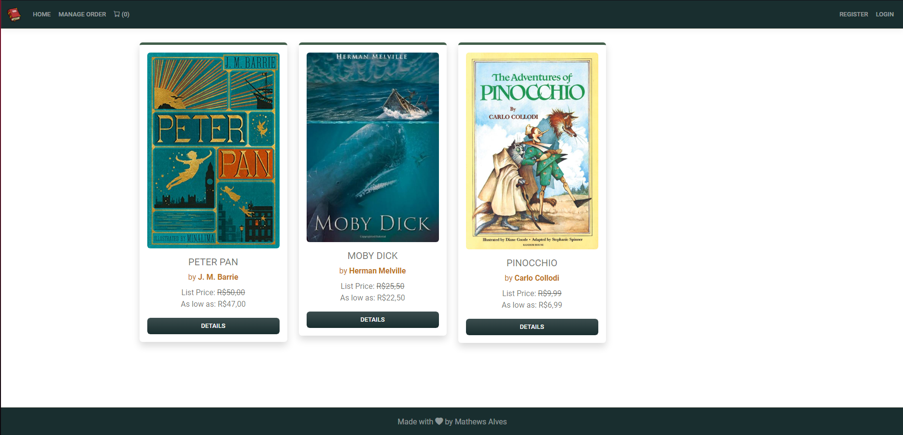
## Author
Mathews Alves [ LinkedIn](https://www.linkedin.com/in/mathews-alves/)
## Table of contents

* [General info](#general-info)
* [Technologies](#technologies)
* [Features](#features)
* [Future Features](#future-features)
* [Screenshots](#screenshots)
* [Setup](#setup)
    * [Facebook App Setup](#facebook-app-setup)
    * [Stripe Setup](#stripe-setup)
    * [TinyMCE Setup](#tinymce-setup)
    * [Google App Password Setup](#google-app-password-setup)
* [Sources](#sources)
## General Info
Bulky was created to showcase my knowledge and growth building web applications using .NET technologies. Even though this project presents some front-end development, its main focus is on the back-end side.

This application is completed, however more features will be added as time passes.
## Technologies
This project was created with:

* **Front-end:** 
    * Bootstrap v5
    * Bootstrap icons
    * Jquery - DataTable
    * Sweetalert2
    * Toastr

* **Back-end:**
    * ASP.NET Core MVC
    * .NET 7
    * SQL Server
    * Azure
    * Stripe
    * Facebook Authentication / Login
    * Microsoft Authentication / Login
    * MailKit & MimeKit


## Features

- **General:**
    - User registration
    - User authentication/login using Facebook and/or Google
    - List all products at the store
    - Vizualize products details
    - Add products to cart
    - Vizualize and change products in cart
    - Vizualize shipping details and products in the cart
    - Place and pay new order
    - Vizualize previus order details and status
    - Send emails about account registration and placing new orders
- **Admin:**
    - Create new user: Customer, Company, Employee or Admin
    - Change order status and details
    - Create, edit or delete produts, categories and company details
    - Change user roles and companies
    - Block or Unblock users

## Future Features

These are features that will be included in the future, but not necessarily in this order

- Google authentication/login
- Shipping calculation
- Email notifications about order status
- Product category filter
- Search bar that search for title, description and author
- Favorites products section
- Email notification for discount on favorites products
## Screenshots

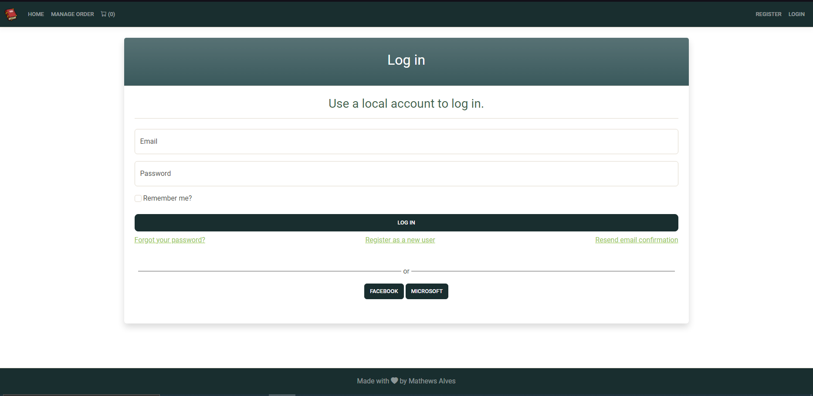


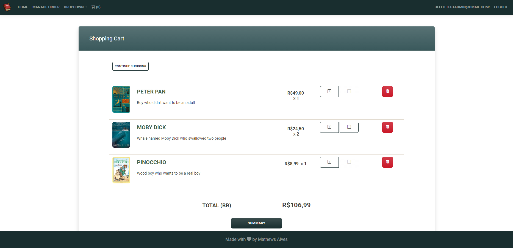
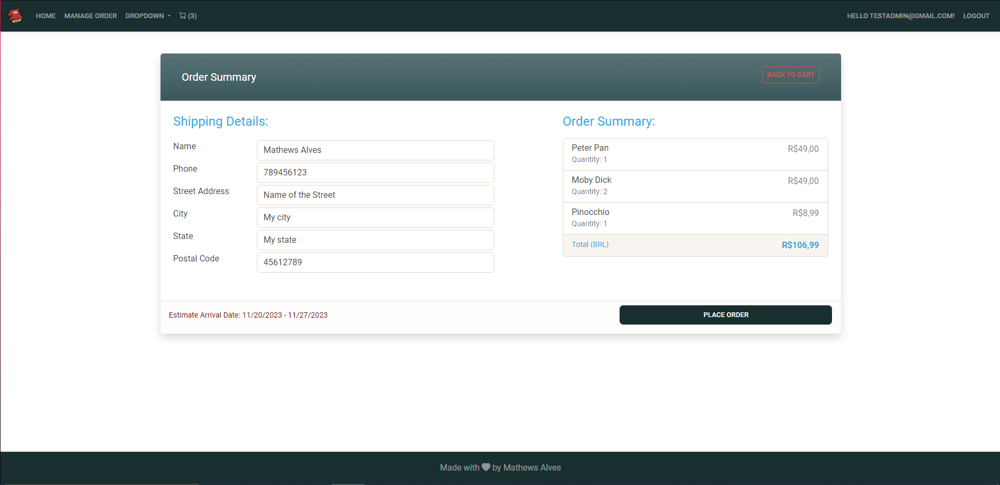
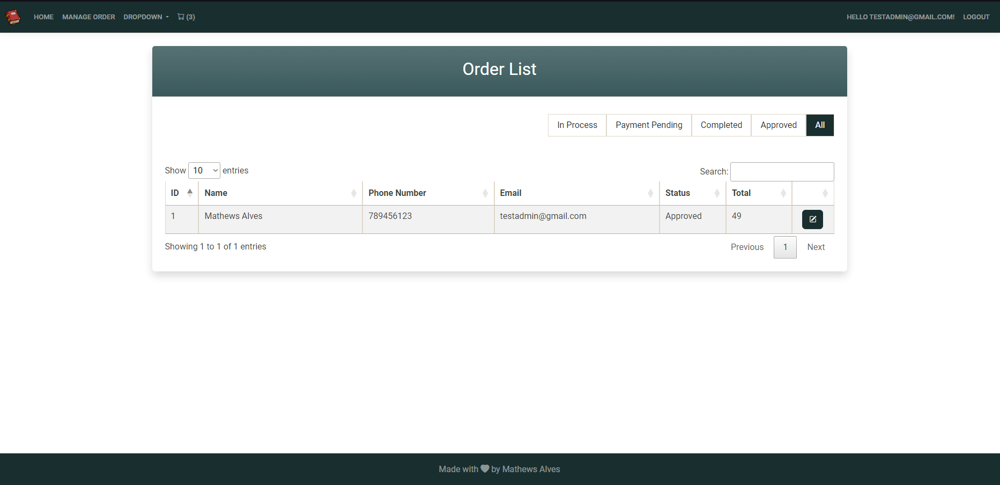
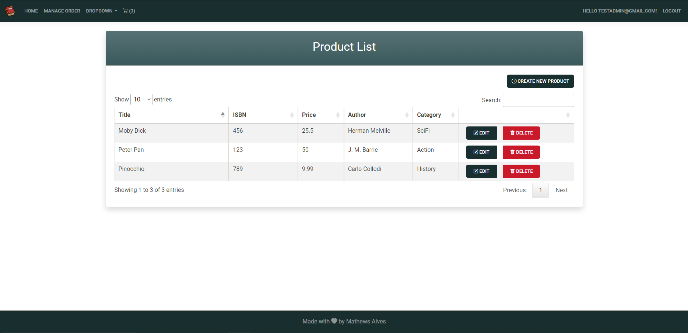
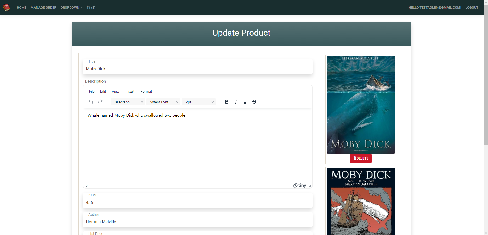
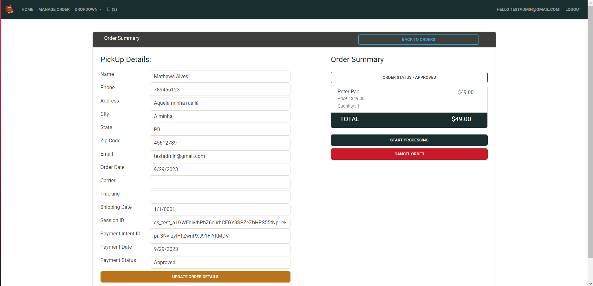
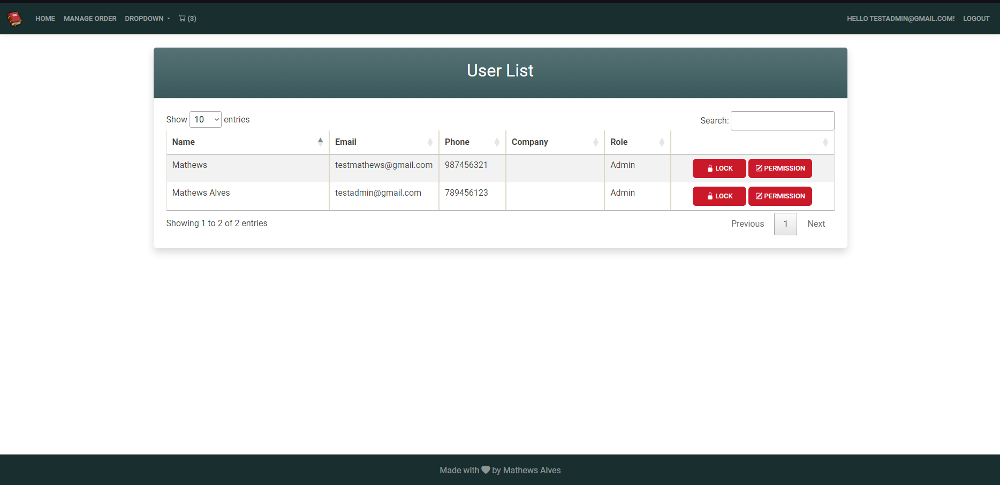
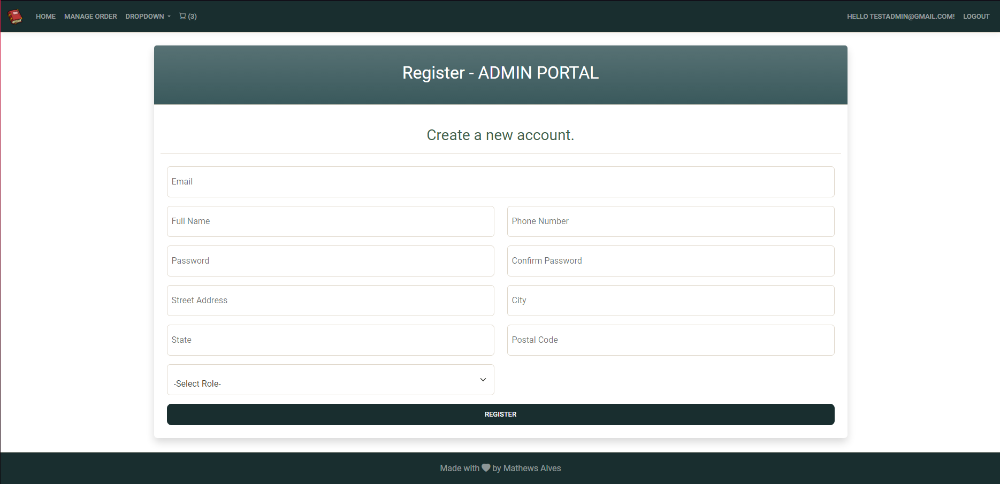
## Setup

1. Download and install [.NET 7 latest secury patch SDK](https://dotnet.microsoft.com/en-us/download/dotnet/7.0).

2. Download and install [Visual Studio 2022](https://visualstudio.microsoft.com/vs/) to support the .NET version.

3. Download and install [SQL Server 2022 Developer](https://www.microsoft.com/en-us/sql-server/sql-server-downloads).

4. Download and install [SQL Server Management Studio](https://learn.microsoft.com/en-us/sql/ssms/download-sql-server-management-studio-ssms?view=sql-server-ver16#download-ssms) that supports the SQL Server version installed previously.

5. Clone this repository in the desired repository.     
`git clone https://github.com/Swehtam/Bulky.git`

6. Create a [Facebook App](#facebook-setup) and change the keys in the project to use Facebook authentication/login.

7. Create a [Microsoft Azure App Registrations](#microsoft-azure-app-registrations-setup) and change the keys in the project to use Microsoft authentication/login.

8. Create a [Stripe](#stripe-setup) account and change the keys in the project to use Stripe to process payments.

9. Create a [TinyMCE](#tinymce-setup) account and change the keys in the project to use TinyMCE rich text editor.

10. Create a [Google App Password](#google-app-password-setup) and change the email and password in the project so you can send e-mails using SMTP.

11. In the project open the **"./BukyWeb/appsettings.json"** file or create and open the [**Secrets.json**](https://dotnetcoretutorials.com/using-user-secrets-configuration-in-net/#Creating_User_Secrets_via_Visual_Studio) file, and add the key-values for the admin password, as shown in the code below:
```
"Admin": {
    "Password": "1vMP242x;4]("
}
```

12. Execute the project, by clicking on the button as shown in the image below. 
**Note:** The first time you execute the project it'll migrate all the tables to your local database.
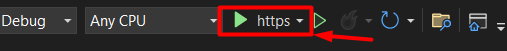

### Facebook App Setup

1. Login on your Meta Account and go to [Apps for Meta Developers page](https://developers.facebook.com/apps).

2. On the **Apps page**, select **"Create app"**, select **"Allow people to log in with their Facebook account"** and choose the name that you want for you App.

3. On the page of your new app, select **"Basic"** under **"App settings"**.

4. Scroll down, select **Add platform**, select **Website** and create.

5. Under **"Website"**, inside **"Site URL"** add your project localhost URL, with the correct, as shown below:
`https://localhost:7005/`

6. Save the changes.

7. On the left, select **"Use cases"**.

8. Under **Authentication and account creation**, select **Customize**.

9. Under **Settings**, select **Go to settings**.

10. Under **Valid OAuth Redirect URIs**, add your project localhost URL, with the correct port and the path **"/sign-facebook"**, as shown below:
`https://localhost:7005/sign-facebook`

11. On the top left select your app name and then **Create Test App**.

12. On the new App Test page, select **"Basic"** under **"App settings"**.

13. Copy the **App ID** value and paste it into the value from the key **"Facebook:AppId"** at the file **"./BukyWeb/appsettings.json"**, as shown below:
```
"Facebook": {
    "AppId": "863022142099592"
}
```

14. Copy the **App secret** value and past it into the value from the key **"Facebook:AppSecret"** at the file **"./BukyWeb/appsettings.json"** or create and paste the value into the [**Secrets.json**](https://dotnetcoretutorials.com/using-user-secrets-configuration-in-net/#Creating_User_Secrets_via_Visual_Studio) file, as shown below:
```
"Facebook": {
    "AppSecret": "0gX3QSizT03qcv2ecqC95EMVgXYToUag"
 }
```

### Microsoft Azure App Registrations Setup

1. Login on your [Microsoft Azure Portal](https://portal.azure.com/#home).

2. Search and create a new registration from the resource **"App registrations"**.

3. Add your project localhost URL, with the correct port and the path **"/signin-microsoft"**, at the **Redirect URI**, as shown below:
`https://localhost:7005/signin-microsoft`

4. At the **Overview page** of the new registration, copy the **"Application (client) ID"** and paste it into the value from the key **"Microsoft:ClientId"** at the file **"./BukyWeb/appsettings.json"**, as shown below:
```
"Microsoft": {
    "ClientId": "b2af27c3-ba33-43b7-9e4a-f2c02874a272"
}
```

5. Under **Certificates & secrets**, create a new client secret, copy the value and past it into the value from the key **"Stripe:SecretKey"** at the file **"./BukyWeb/appsettings.json"** or create and paste the value into the [**Secrets.json**](https://dotnetcoretutorials.com/using-user-secrets-configuration-in-net/#Creating_User_Secrets_via_Visual_Studio) file, as shown below:
```
"Microsoft": {
    "ClientSecret": "0rOrXs1Nxf5w2NutUuy75H2XQxRjAeEDXi8l01xA"
}
```

### Stripe Setup

1. Create or Login on your [Stripe Account](https://dashboard.stripe.com/login).

2. On the top left select your "Bussiness Name", select **New Account**, and create a new account. 
**Note:** You dont need a real bussiness or company to create a Stripe Account.

3. On the home page, select **Developers**.

4. Under **API keys**, look for **Standard keys**:
    1. Copy the token from the **Publishabe key**.

    2. Paste it into the value from the key **"Stripe:PublishableKey"** at the file **"./BukyWeb/appsettings.json"**, as shown below:
    ```
    "Stripe": {
        "PublishableKey": "pk_test_vVWg8qjWVGg3v7NRHkFM676ne527T7uKY08NdO9uBuuvlyH1XE"
    }
    ```

    3. Copy the token from the **Secret key**.

    4. Paste it into the value from the key **"Stripe:SecretKey"** at the file **"./BukyWeb/appsettings.json"** or create and paste the value into the [**Secrets.json**](https://dotnetcoretutorials.com/using-user-secrets-configuration-in-net/#Creating_User_Secrets_via_Visual_Studio) file, as shown below:
    ```
    "Stripe": {
        "SecretKey": "sk_test_jY1aB7ftOruHXpXXe32xebdfxPyGmUnSPoF7ovhW9jM7wxLijT"
    }
    ```

### TinyMCE Setup
1. Create or Login on your [Tiny Account](https://www.tiny.cloud/auth/login/).

2. Under **Integrate TinyMCE**, look for the code under **"2. Add the TinyMCE code snippet"** and copy the script that contains your API key, as shown below:
```
<script src="https://cdn.tiny.cloud/1/x2tmyn8r703ilyxo6n5q54ygq1v5nw1q6aowpplfupww8fxh/tinymce/6/tinymce.min.js" referrerpolicy="origin"></script>
```

3. Remove the previous TinyMCE script at the bottom of the file **"./BulkyWeb/Views/Shared/Layout.cshmtl"** and add the one that you copied with you API key.

### Google App Password Setup

1. Login on your [Google Account](https://myaccount.google.com).

2. Select **Security**.

3. Under **Signing in to Google**, select **App Passwords**. If you don’t have this option, select **2-Step Verification**.

4. Choose **App Passwords**.

5. Write the name of the app that you want to generate a password, and select **Create**.

6. Copy the generated password and paste the value into the **"./BukyWeb/appsettings.json"** file or create and paste the value into the [**Secrets.json**](https://dotnetcoretutorials.com/using-user-secrets-configuration-in-net/#Creating_User_Secrets_via_Visual_Studio) file at the key "SMTPPassword". Besides that add your google email to the key "GoogleAccount",  as shown on the code below:
```
"GoogleApps": {
    "GoogleAccount": "youremail@gmail.com",
    "SMTPPassword": "abcdefghijklmnop"
}
```

7. If you encounter an username and password not accepted error, please follow this [tutorial](https://www.youtube.com/watch?v=Y_u5KIeXiVI) and see if it solves your problem.
## Sources

This app is inspired by  Bhrugen Patel course on Udemy, ".NET Core MVC - The Complete Guide 2023 [E-commerce] [.NET8]". Link to Udemy course: [link](https://www.udemy.com/course/complete-aspnet-core-21-course/)
